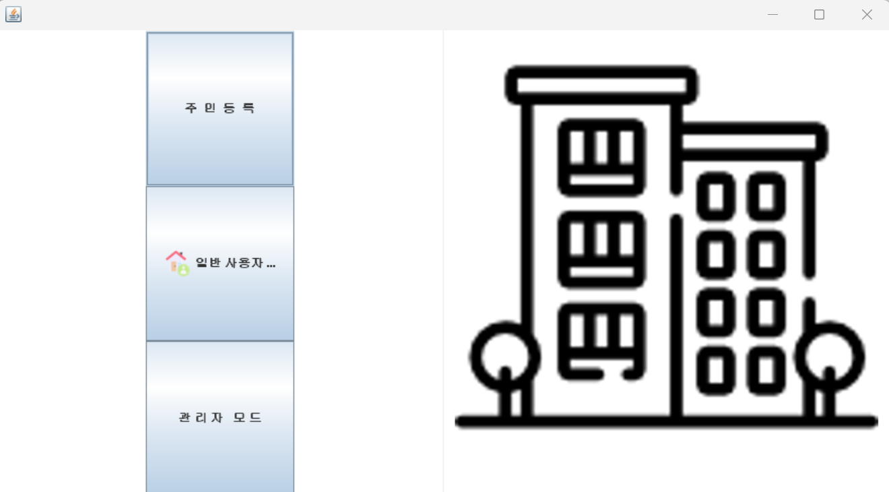

    
    

    
 
    <h2 style="border-bottom: 1px solid #d8dee4; color: #282d33;"> 아파트 관리 프로그램 </h2>  
    

    
 주제 : gui로 만든 아파트 관리 프로그램   
      기능 : 사용자모드 (공지사항 확인, 차량 등록, 청소일정 확인 등) 
      관리자모드(공지사항 및 청소일정 등록, 등록 차량 조회, 주민 조회)  
      성과 : java swing package 이해(컨테이너, 레이아웃 등), JFrame을 상속받아서 화면 구성 및 기능 추가 
        ActionListener 어노테이션 사용 
 
    

    

    <h2 style="border-bottom: 1px solid #d8dee4; color: #282d33;"> 🛠️ Tech Stacks </h2>   
    
 
          
      
          

    

    
